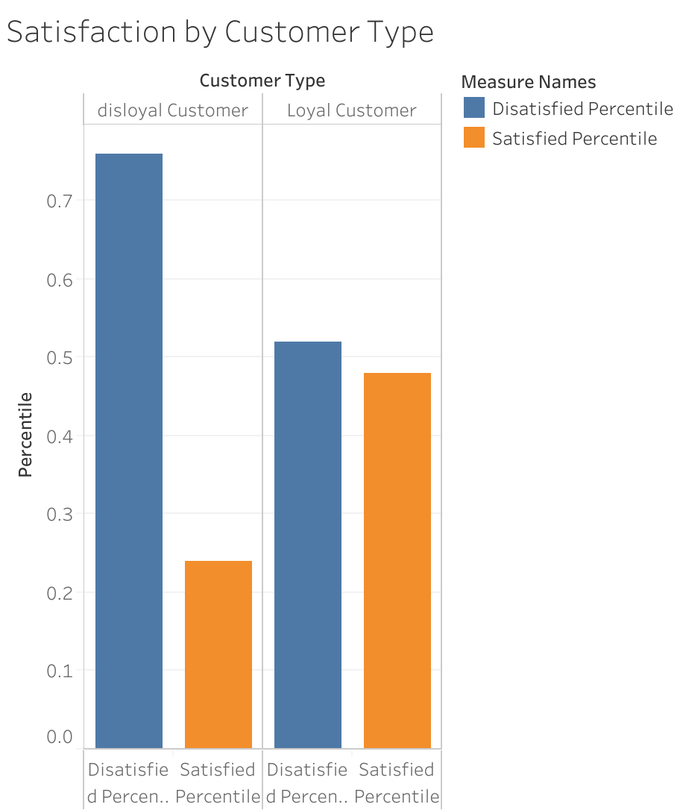
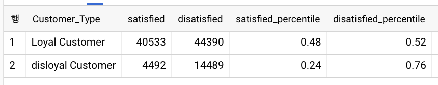
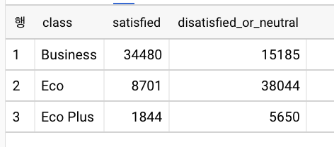
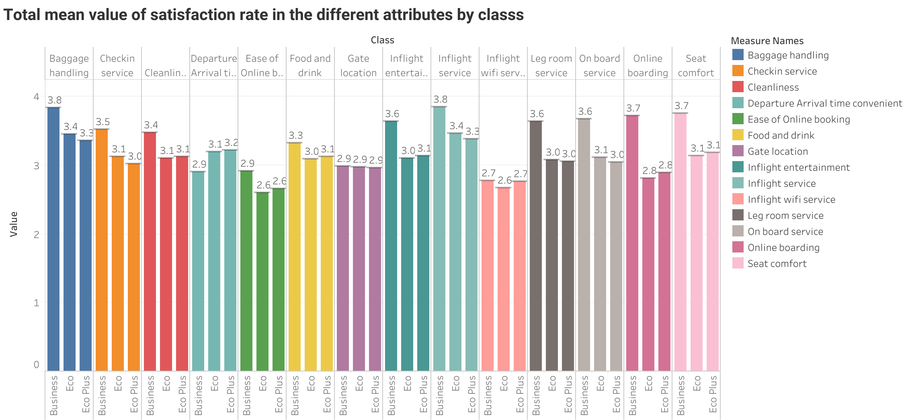
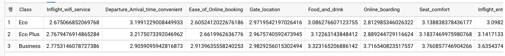
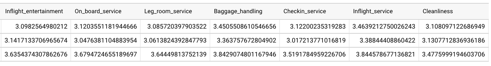
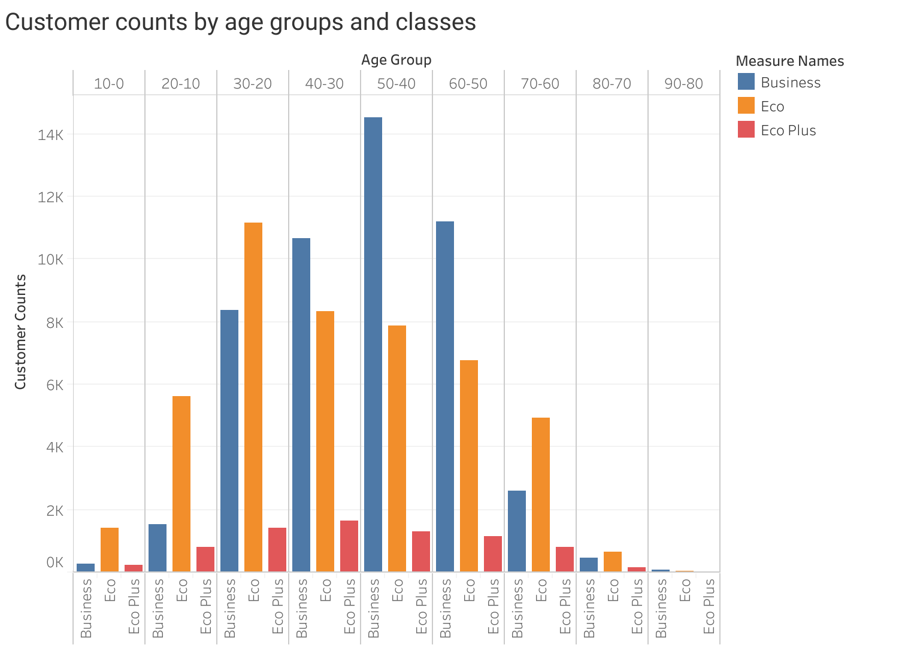
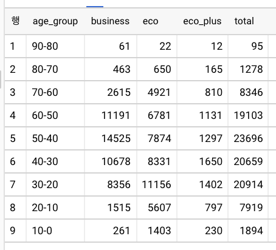
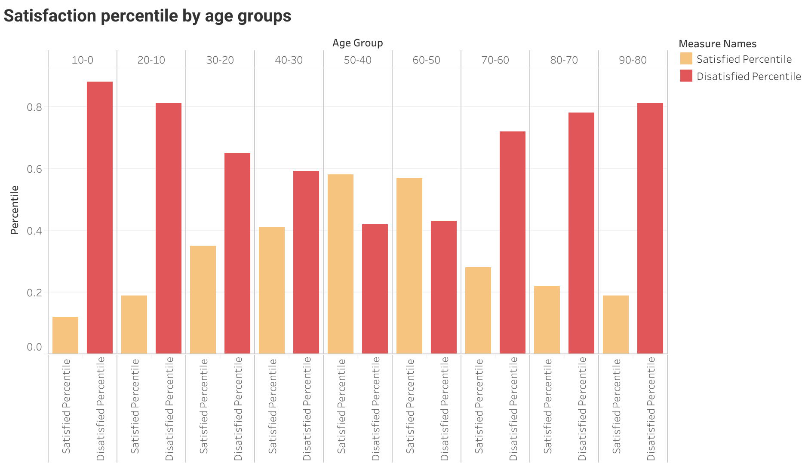
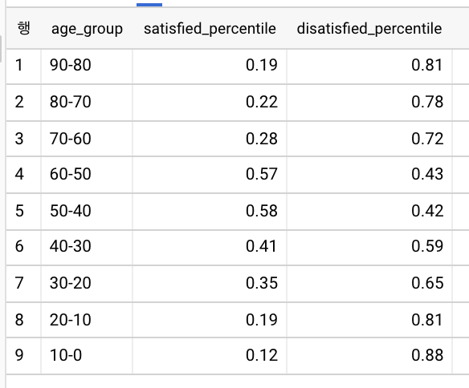

# Airline Satisfaction Analysis

## Introduction

The purpose of this project is to investigate the satisfaction rate of customers in an airline. Specifically, we aim to uncover valuable insights that can be utilized for improving customer experiences/services within the airline. This exploration will be based on a dataset consisting of 103,904 rows and 25 columns.

The primary question this project seeks to answer is:

- **Question**: Are customers satisfied with the airline?

The data sources and tools used in this project include:

- **Data Sources**: https://www.kaggle.com/teejmahal20/airline-passenger-satisfaction
- **Tools used**: SQL (Big Query) and Tableau

The dataset presents straightforward customer information (id, gender, customer type, type of travel, age, class, from columns 1 to 6), along with a satisfaction rating scale from 0 to 5 across various attributes (such as wifi service, seat comfort, etc., from columns 8 to 21). It also provides data on flight distance (column 7), departure and arrival delay minutes, as well as overall satisfaction remarks (categorized as satisfied, neutral, or dissatisfied).

## 1. Satisfied or Dissatisfied?
According to the results presented below, a significant number of customers did not have a satisfying experience with the airline. The majority of customers reported their general satisfaction as 'neutral or dissatisfied' (58,879 responses).

## 2. Satisfaction by Customer Type
Let's first examine the distribution of satisfaction across different customer types.

As shown above, disloyal customers are predominantly dissatisfied with the airline. However, even among loyal customers, the percentage of dissatisfied responses slightly outnumbers satisfied ones. These results suggest a need for improvement in customer experience/services to retain loyal customers and convert disloyal ones.

But these results don't fully elucidate the factors influencing customer satisfaction. Let's delve deeper to investigate how customers from different classes rate their experiences.

## 3. Satisfaction by Class
The results extracted via SQL queries reveal that the majority of Business class customers are satisfied with the airline's customer service (34,480 responses). In contrast, customers in the Economy and Economy Plus classes largely responded as dissatisfied or neutral.

This prompts the following questions:

- Why did the majority of Business class customers respond as satisfied?
- Why did the majority of Economy and Economy Plus customers respond as dissatisfied or neutral?
To answer these, we need to investigate the dataset further.

## 4. Satisfaction in Attributes by Class
I calculated the overall mean value of satisfaction rate for all 14 different attributes, including Inflight wifi service, Departure/Arrival time convenience, Ease of Online booking, Gate location, Food and drink, Online boarding, Seat comfort, Inflight entertainment, On-board service, Legroom service, Baggage handling, Check-in service, Inflight service, and Cleanliness. These were then grouped by class.

As shown in the graph, Business class customers reported a higher mean satisfaction rate in most attributes except for Departure/Arrival time convenience, Inflight wifi service, and Gate location. Conversely, Economy and Economy Plus customers showed a lower mean satisfaction rate in most attributes, particularly Seat comfort, Online boarding, Onboard service, Legroom service, and Inflight entertainment.

Nevertheless, all classes rated Ease of Online booking, Gate Location, and Inflight wifi service below 3, indicating room for improvement to enhance customer experience and services.

## 5. Satisfaction by Age
Next, how does satisfaction vary among different age groups?

First, let's examine the distribution of age groups across different classes.

The graph below shows customer counts by age groups and classes. It is noticeable that the 40-50 and 50-60 age groups predominantly occupy the Business class, likely due to higher income levels enabling them to afford Business class tickets. As expected, the remaining age groups are largely in the Economy classes.

Customers aged between 40-50 and 50-60 tend to respond as satisfied, unlike other age groups. This is presumably because, as previously observed, most customers in these age groups belong to the Business class and have responded as generally satisfied.

## Conclusion
The following are the key findings from the analysis:

- A large number of disloyal customers are dissatisfied with the airline.
- Customers in the Business class are generally satisfied with the airline; in contrast, most customers in the - - - Economy and Economy Plus classes are dissatisfied or neutral.
- The attributes such as Ease of Online booking, Gate Location, and Inflight wifi service scored relatively lower satisfaction rates across all classes.
- Customers aged between 40-60 are slightly more satisfied with the airline compared to other age groups.

This project highlights that the airline's customer experience/service isn't very good overall. There is a particularly urgent need to improve the experiences offered to Economy and Economy Plus customers to meet acceptable satisfaction standards. As for Business class, maintaining the current standards would suffice, but there's room for improvement, especially in Departure/Arrival time convenience, which appears to be important to these customers. Improving Ease of Online booking, Gate Location, and Inflight wifi service is also necessary across all classes.

